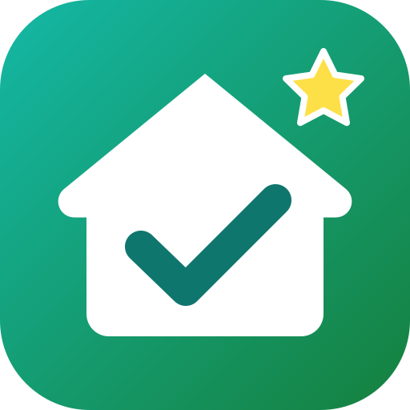

# 🦸 Alltagsheld – dein Alltagshelfer

Web-App (installierbar aufs Handy) für den Alltag. Startseite **🏠 Heute** zeigt Termine, was bald abläuft, das geplante Essen,
den Trainingsstand und die Ausgaben des Monats. Das **＋** öffnet ein Schnellmenü (Produkt, Kassenbon, Einkauf, Termin, Ausgabe, Training).

## 🏋️ Sport für zuhause
- 46 Übungen ohne Geräte mit Anleitung (Aufwärmen, Beine & Po, Bauch & Rücken, Oberkörper, Cardio, Dehnen)
- **Workout-Generator**: Dauer (10–45 Min), Schwerpunkt, Level (Intervalle 30/30, 40/20, 45/15), **🤫 leise** ohne Sprünge
- Klassisches **7-Minuten-Workout**
- **Trainingsmodus**: großer Countdown, Ansage der Übungen, Pieptöne, Pause/Überspringen, Bildschirm bleibt an
- Wochenziel, Serie (Tage in Folge), Verlauf

## 📅 Kalender
- Monatsansicht, Termine mit Art (Arzt, Geburtstag, Müllabfuhr …), Uhrzeit, Notiz
- Wiederholung: wöchentlich, alle 2 Wochen (Müll), monatlich, jährlich (Geburtstage mit Alter)
- Ablaufdaten, Essensplan und Trainings erscheinen automatisch
- Erinnerungen, solange die App offen ist; **📲 Export in den Handy-Kalender** (.ics, inkl. Wiederholung und Erinnerung)

## 💶 Ausgaben
- Schnell erfassen: „12,50 Tanken“ eintippen oder sagen – Kategorie wird erkannt
- Monatsübersicht mit Kategorien, Vergleich zum Vormonat, **Budget** mit „pro Tag noch …“
- **Fixkosten** (Miete, Abos) monatlich automatisch, CSV-Export für Excel
- Kassenbon-Summe wird automatisch als Lebensmittel-Ausgabe gebucht

## 🍽️ Kalorien
- **📦 Barcode** (Open Food Facts) und **🏷️ Nährwerttabelle fotografieren** (Texterkennung direkt auf dem Gerät)
- **🔎 Suche** in über 100 Lebensmitteln/Gerichten, **Text/Sprache**: „1 Apfel und 2 Scheiben Toast“
- Tagesziel nach Mifflin-St-Jeor (Alter, Größe, Gewicht, Aktivität, Ziel), Eiweiß/Kohlenhydrate/Fett, Training wird gutgeschrieben, Wochenübersicht
- Komplett kostenlos – keine Konten, keine kostenpflichtigen Dienste.

## Design anpassen
- Hell, Dunkel oder automatisch, 7 Akzentfarben, drei Schriftgrößen, kompakte Ansicht, Begrüßung mit deinem Namen (Mehr → Design anpassen)
- Ruhige Linien-Icons statt bunter Emojis; Startseite in Bereiche gegliedert (Heute, Küche & Essen, Fitness & Finanzen), Karten einzeln ausblendbar

## Schnellmenü „Neu“
- Zeigt nur, was man jeden Tag braucht: Aufgabe, Einkauf, Termin, Ausgabe, Produkt, Mahlzeit, Notiz, Timer
- Unter Mehr → „Schnellmenü ＋ anpassen“ lässt sich alles andere dazuschalten (z. B. Parken, Paket, Getankt)

## Erinnerungen auch bei geschlossener App
- Mehr → Erinnerungen → „Alle Erinnerungen in den Handy-Kalender“: Medikamente (täglich zur Uhrzeit), Termine & Geburtstage, Aufgaben, Fristen, Kündigungsfristen, Müllabfuhr, Rückgaben, Countdowns – jeweils mit Erinnerung. Kostenlos, ohne Server.

## Geburtstage & Geschenke
- Alle Geburtstage mit Alter („wird 80“, runde Geburtstage markiert), Geschenkideen sammeln, als gekauft abhaken oder auf die Einkaufsliste setzen
- Startseite: Geburtstage der nächsten 7 Tage mit Geschenk-Status

## Tagebuch
- Täglich eine Schreibfrage, Stimmung, drei Dinge, für die du dankbar bist; Rückblick „vor einer Woche / einem Monat / einem Jahr“, Schreib-Serie
- Abends erinnert die Startseite daran; die Gewohnheit „Dankbarkeit notieren“ wird automatisch abgehakt

## Vertieft
- Einkaufsliste nach Supermarkt-Gängen sortiert (Obst & Gemüse, Brot, Kühlregal, … Drogerie, Haushalt) – abschaltbar
- Ausgaben: Verlauf der letzten 6 Monate mit Durchschnitt, Monat antippen für Details
- Gewohnheiten: Verlauf der letzten 12 Wochen als Kalender, Erfolgsquote und bester Wochentag

## Verträge & Abos
- Handy, Internet, Strom, Versicherung, Streaming … mit Mindestlaufzeit, Verlängerung und Kündigungsfrist
- Zeigt, bis wann du kündigen musst (Erinnerung + Startseite + Kalender) und was alles zusammen pro Monat/Jahr kostet
- „Kündigung schreiben“ erstellt ein fertiges Kündigungsschreiben als Notiz (und kopiert es)

## Checklisten & Routinen
- Vorlagen: Haus verlassen, Morgen- und Abendroutine, Urlaub – Wohnung, Arzttermin, Wocheneinkauf – oder eigene Listen
- Routinen setzen sich jeden Morgen zurück; angeheftete Listen lassen sich direkt auf der Startseite abhaken

## Stundenplan
- Für Schule, Uni oder Kurse – auch mehrere Pläne (z. B. pro Kind); jedes Fach hat immer dieselbe Farbe
- Startseite: was jetzt läuft und was als Nächstes kommt, ab 15 Uhr schon der Plan für morgen

## Werkzeuge (neu)
- Prozente & Mehrwertsteuer (Rabatt, brutto/netto, Veränderung in %), Schlafrechner (90-Minuten-Zyklen)

## Kopfzeile & Logo
- Neues Logo; Kopfzeile zeigt Datum bzw. den aktuellen Bereich, Suche und Profil-Knopf mit deiner Initiale

## Müllabfuhr
- Restmüll, Bio, Papier, Gelber Sack, Glas, Sperrmüll mit Rhythmus (wöchentlich, 2- oder 4-wöchentlich, einmalig)
- „Heute Abend rausstellen“ auf der Startseite und als Erinnerung ab 17 Uhr, Export in den Handy-Kalender mit Erinnerung am Vorabend

## Parken
- „Hier geparkt“ speichert den Standort (GPS) und eine Notiz (z. B. Ebene 2), Karte und Fußweg-Route zum Auto
- Parkuhr mit Erinnerung 10 Minuten vor Ablauf, verlängern mit einem Tipp

## Pakete & Retouren
- Bestellungen mit Liefertag und Sendungsverfolgung (DHL, Hermes, DPD, GLS, UPS)
- Nach „Angekommen“ läuft die Rückgabefrist (Standard 14 Tage) – Erinnerung, bevor sie abläuft

## Auto & Tanken
- Tankbuch: Kilometerstand, Liter, Betrag → Verbrauch (l/100 km), Preis pro Liter, Spritkosten im Jahr, Kosten pro km
- Tanken wird auf Wunsch automatisch als Ausgabe (Mobilität) eingetragen

## Wichtige Nummern
- Hausarzt, Vermieter, Kita, Handwerker … mit Anruf-Knopf; dazu 110, 112, 116 117, Sperr-Notruf 116 116, Telefonseelsorge

## Pflanzen
- Gießplan je Pflanze (12 Vorlagen), „gegossen“ mit einem Tipp – auch direkt auf der Startseite, Erinnerung wenn fällig

## Verliehen & Geliehen
- Wer hat was von dir, was hast du dir geliehen – mit Rückgabedatum, Erinnerung und Eintrag im Kalender

## Countdowns
- Tage bis Urlaub, Geburtstag, Konzert – auch jährlich wiederkehrend, die nächsten zwei als „Vorfreude“ auf der Startseite

## Fokus-Timer
- Pomodoro (25/5, 15/3, 50/10), lange Pause nach jeder 4. Runde, Bildschirm bleibt an, Statistik der letzten 7 Tage

## Notfallpass
- Blutgruppe, Allergien, Vorerkrankungen, Medikamente (aus dem Medikamentenplan), Krankenkasse, Notfallkontakte zum direkten Anrufen, 112 und 116 117

## Gedanke des Tages
- Täglich ein Spruch oder kleiner Alltagstipp auf der Startseite (ausblendbar)

## 💊 Medikamente
- Einnahmeplan mit Uhrzeiten und Wochentagen, abhaken (auch auf „Heute“), Erinnerung zur Uhrzeit
- Vorrat wird mitgezählt, Warnung „bald nachkaufen“ mit einem Tipp auf die Einkaufsliste

## 📄 Fristen & Dokumente
- Ausweis, Reisepass, Führerschein, TÜV, Garantie, Versicherung, Kündigungsfristen, Impfungen
- Ablauf direkt eingeben oder aus Ausstellungsdatum + Laufzeit berechnen; Vorwarnung, Kalender-Eintrag

## 🔢 Zählerstände
- Strom, Gas, Wasser, Heizung: Verbrauch pro Tag, Trend, Hochrechnung aufs Jahr, Kosten mit eigenem Tarif

## 🧰 Werkzeuge
- Mehrere Küchen-Timer, Stoppuhr mit Runden, Küchen-Umrechner (Tasse/EL/TL ↔ Gramm je Zutat), Backofen °C/°F/Umluft
- Rechnung teilen mit Trinkgeld (centgenau), Münze, Würfel, „Was koche ich?“, Auslosen aus eigener Liste

## 🏆 Erfolge, Wochenrückblick & mehr
- 14 Erfolge mit Fortschritt, Wochenrückblick im Vergleich zur Vorwoche (sonntags/montags auch auf „Heute“)
- 🧘 Atemübungen (Box-Atmung, 4-7-8, ruhig atmen) mit animiertem Kreis
- 💰 Einnahmen (z. B. „+1800 Gehalt“) mit Saldo, 🐷 Sparziele mit Monatsrate
- 📋 Notiz-Vorlagen (Packlisten, Umzug, wichtige Nummern …), Startseite anpassen, Erinnerung an die Datensicherung

## ✅ Aufgaben
- Eingabe in normaler Sprache: „Müll rausbringen jeden Dienstag“, „Steuer bis 31.10. wichtig“, „Mama anrufen morgen um 18 Uhr“
- Wiederholungen (täglich, werktags, wöchentlich, alle 2 Wochen, monatlich), Kategorien, Wichtigkeit, Erinnerung zur Uhrzeit
- 🧹 Putzplan-Vorlage mit 10 wiederkehrenden Haushaltsaufgaben; Aufgaben erscheinen auf „Heute“ und im Kalender

## 💧 Gewohnheiten
- Vorlagen (Wasser 8 Gläser, Obst & Gemüse, Vitamine, Lesen …) oder eigene, mit Tagesziel
- +1 direkt auf der Startseite, Serie, Wochenpunkte, Quote der letzten 30 Tage

## ❤️ Gesundheit
- Gewicht mit Verlaufskurve, Trend (7/30 Tage), BMI und Zielgewicht
- Stimmung, Schlaf und kurzes Tagebuch pro Tag

## 📝 Notizen
- Farbig, anheften, durchsuchen, teilen; Zeilen mit „[ ]“ werden zur abhakbaren Checkliste

## 🌤️ Wetter & 🔍 Suche
- Wetter für deinen Ort (Open-Meteo, ohne Konto) mit Tipps wie „☂️ Regenschirm mitnehmen“ oder „🧊 Frost – Scheiben kratzen“
- Suche über alles: Vorrat, Einkauf, Aufgaben, Termine, Notizen, Rezepte, Ausgaben, Übungen

## 🧊 Küche & Einkauf

- **Barcode scannen** → Produktname, Bild und Zutat kommen automatisch von [Open Food Facts](https://world.openfoodfacts.org).
  Unbekannte Produkte tippst du einmal ein – beim nächsten Scan sind sie gemerkt.
- **Ablaufdatum scannen** per Texterkennung (MHD, „verbrauchen bis“, `12.10.26`, `10/2026`, `18 OKT 2026` …).
  Werden mehrere Daten erkannt, kannst du das richtige antippen. Alternativ: Schnellauswahl (+3 Tage, +1 Woche, „typisch“ …).
- **Vorrat** nach Ablaufdatum sortiert, farbig markiert (abgelaufen / heute / bald), getrennt nach Kühlschrank, Gefrierfach, Vorrat.
  ✓ = verbraucht, 🗑 = weggeworfen (mit Rückgängig), Statistik „gerettet“.
- **175 Rezepte** (Frühstück, Hauptgerichte, Suppen, Salate, Snacks, Süßes) – **Rezeptvorschläge** aus dem, was da ist – Rezepte, die bald ablaufende Zutaten retten, stehen oben.
  Filter (⭐ Favoriten, 🥕 vegetarisch, ⚡ bis 20 Min, ✍️ eigene), Suche, „Gekocht“ trägt die Zutaten aus.
- **Eigene Rezepte** anlegen und bearbeiten.
- **📅 Wochenplan**: Rezepte auf die nächsten 7 Tage legen, fehlende Zutaten mit einem Tipp auf die Einkaufsliste.
- **🛒 Einkaufsliste**: mehrere Einträge per Komma, Vorschläge, abhaken, Gekauftes direkt in den Vorrat, Liste teilen (z. B. WhatsApp).
  **Immer im Haus**: Ist ein Grundnahrungsmittel aufgebraucht, landet es automatisch auf der Liste; sonst fragt die App „Nachkaufen?“.
- **🥛 Geöffnet / ❄️ Einfrieren** passen das Ablaufdatum automatisch an (typische Haltbarkeit je Lebensmittel).
- **MHD oder Verbrauchsdatum**: abgelaufenes MHD → „oft noch gut, prüfen“, Verbrauchsdatum → „nicht mehr essen“.
- **⚡ Schnellauswahl** häufiger Lebensmittel ohne Scannen, Sortierung, Notizen, Preise, Bereich „Bad & Haushalt“ (z. B. Medikamente).
- **🎤 Spracheingabe**: „Milch, zwei Packungen Eier und Brot“ auf die Einkaufsliste, „zwei Joghurt bis 12. Oktober“ als Produkt.
- **🧾 Kassenbon scannen**: Produkte und Preise vom Bon lesen und mit einem Tipp in den Vorrat übernehmen.
- **👨‍🍳 Kochmodus**: Schritt für Schritt in großer Schrift, Bildschirm bleibt an, Timer werden aus dem Rezepttext erkannt („35 Min.“).
- **🔗 Einkaufsliste per Link teilen** – wer den Link öffnet, übernimmt die Liste in seine App. **🎲 Was koche ich heute?**
- **App-Verknüpfungen** (lange auf das App-Symbol drücken): Hinzufügen, Einkaufsliste, Rezepte.
- **Statistik** pro Monat, Wert der weggeworfenen Lebensmittel, was am häufigsten im Müll landet.
- **Ratgeber**: MHD vs. Verbrauchsdatum, Kühlschrank-Zonen, Einfrieren, Lagertipps für ~60 Lebensmittel.
- **Erinnerung** beim Öffnen, wenn etwas heute/morgen abläuft (Browser-Benachrichtigung).
- Funktioniert offline (außer Produktsuche), Sicherung als JSON exportieren/importieren. Alle Daten bleiben auf dem Gerät.

## Konto & Cloud-Sync (Supabase)

Optional: Mit Konto sind die Daten auf allen Geräten gleich und bei Handyverlust sicher. Ohne Konto bleibt alles wie bisher nur auf dem Gerät („Ohne Konto weiter“).

- Anmelden, Konto erstellen (mit Passwort-Stärke-Anzeige), Passwort vergessen, Passwort ändern, Abmelden, Konto löschen
- Automatischer Abgleich: Änderungen werden nach 1–2 Sekunden hochgeladen, beim Öffnen der App werden Änderungen anderer Geräte geholt; offline wird nachgeholt
- Erste Anmeldung auf einem Gerät mit eigenen Daten: Auswahl „Daten aus dem Konto laden“ oder „Daten dieses Geräts hochladen“; bei Änderungen auf zwei Geräten gleichzeitig fragt die App, welche Version gilt
- Jede Person sieht nur ihre eigenen Daten (Row Level Security); der anon-Schlüssel ist öffentlich und darf in der App stehen

### Einrichtung (einmalig, ca. 5 Minuten, kostenlos)

1. Auf [supabase.com](https://supabase.com) ein Projekt anlegen (Free Plan, Region z. B. Frankfurt).
2. **SQL Editor** → Inhalt von `supabase/schema.sql` einfügen → **Run**. Das legt die Tabelle `user_data` mit Zugriffsschutz an.
3. **Authentication → URL Configuration**: als *Site URL* die Adresse der App eintragen, z. B. `https://paullammers267-art.github.io/Seach/kuehlschrank/`, und dieselbe Adresse unter *Redirect URLs*. Dorthin führen die Links aus den Bestätigungs- und Passwort-E-Mails.
4. **Project Settings → API**: *Project URL* und den *anon public*-Schlüssel kopieren und
   - entweder in `config.js` eintragen (gilt dann für alle, die die App öffnen),
   - oder in der App unter **Mehr → Konto** einfügen (gilt nur für dieses Gerät).
5. Optional: Unter **Authentication → Providers → Email** lässt sich „Confirm email“ ausschalten – dann ist man nach dem Registrieren sofort angemeldet. Mit Bestätigung kommt erst eine E-Mail mit Link.

Hinweis: Der kostenlose Supabase-Mailversand ist auf wenige E-Mails pro Stunde begrenzt – für den Alltag reicht das. Für viele Nutzer unter **Authentication → SMTP** einen eigenen Mailversand eintragen.

## Benutzen

Die Kamera funktioniert nur über **https** (oder localhost). Mit GitHub Pages ist die App erreichbar unter
`https://paullammers267-art.github.io/Seach/kuehlschrank/` → im Browser-Menü „Zum Startbildschirm hinzufügen“.

Lokal: `npx serve kuehlschrank` und http://localhost:3000 öffnen.

## Aufbau

| Datei | Inhalt |
|---|---|
| `index.html`, `style.css` | Oberfläche (mobil, Dark Mode) |
| `app.js` | Speicherung, Kamera-Scanner (BarcodeDetector bzw. ZXing, Tesseract.js), Open Food Facts |
| `logic.js` | Datumserkennung, Ablauf-Status, Zuordnung Produkt → Zutat, Rezept-Bewertung, Haltbarkeit nach Öffnen/Einfrieren, Statistik |
| `imageprep.js` | Bildaufbereitung für die Texterkennung (Punktmatrix, Kontrast, Hell/Dunkel) |
| `recipes.js` | 175 Rezepte in 6 Kategorien (Frühstück, Hauptgericht, Suppe, Salat, Snack, Süßes) |
| `sport.js` | Übungen, Workout-Generator, Trainings-Statistik |
| `planner.js` | Kalender (Wiederholungen, Erinnerungen, iCal) und Ausgaben (Kategorien, Budget, CSV) |
| `nutrition.js` | Lebensmittel-Datenbank, Kalorienziel, Nährwerttabelle/Open-Food-Facts/Text erkennen |
| `nutrition-ui.js` | Kalorien-Oberfläche, Hell/Dunkel |
| `extras.js` | Umrechner, Rechnung teilen, Medikamente, Fristen, Zählerstände, Sparziele, Atemübung, Erfolge |
| `extras-ui.js` | Oberfläche dafür, Wochenrückblick, Startseite anpassen |
| `alltag.js` | Oberfläche für Heute, Sport, Kalender, Ausgaben |
| `life.js` | Aufgaben (Spracherkennung, Wiederholung), Gewohnheiten, Gesundheit, Wetter-Tipps |
| `life-ui.js` | Oberfläche für Aufgaben, Gewohnheiten, Gesundheit, Notizen, Wetter, Suche |
| `plus.js`, `plus-ui.js` | Pflanzen, Verliehen, Countdowns, Fokus-Timer, Notfallpass, Design anpassen |
| `daily.js`, `daily-ui.js` | Müllabfuhr, Parken, Pakete & Retouren, Tankbuch, wichtige Nummern, Schnellmenü |
| `organize.js`, `organize-ui.js` | Verträge & Abos, Checklisten, Stundenplan, Rechner, Kopfzeile |
| `deep.js`, `deep-ui.js` | Einkaufsliste nach Gängen, Ausgaben-Verlauf, Gewohnheits-Kalender, Erinnerungs-Export, Geburtstage, Tagebuch |
| `auth.js`, `auth-ui.js`, `config.js` | Konto & Cloud-Sync mit Supabase (Anmeldung, Abgleich, Konflikte) |
| `supabase/schema.sql` | Datenbank-Tabelle mit Zugriffsschutz für Supabase |
| `sw.js`, `manifest.webmanifest` | Offline & Installation |

Tests: `npm test` (im Hauptordner).
